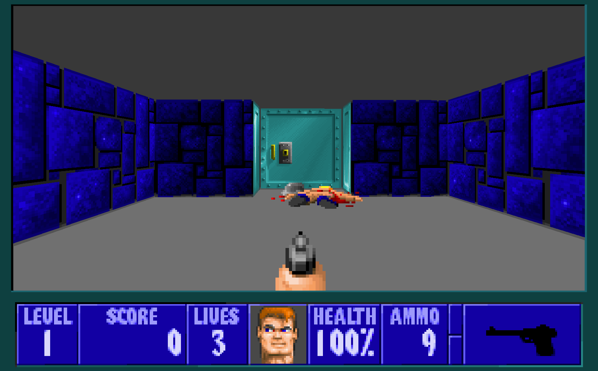

# Wolfenstein-3D
Copy of Wolfenstein 3D game

##  Overall info

- The whole project is written from nothing
- This copy does not have everything the original has
- Only the first level is available
- You can meet two types of enemy (Trooper, Dog)

## Installation

 - Clone/download the repository
 - In terminal run `npm i` to install dependencies
 - In terminal run `npm run build` to build project
 - Run `\dist\index.html` with server (e.g. Live Server)
    

## Features

- Own custom display engine written in WebGL
- Level possible to complete
- Animations
- Audio
- Visual effects
- Pickups
- Collisions
- 4 different weapons to use
- Secret rooms
- Life/ammunition
- AI logic (shooting, pathfinding, walking, door opening)
- Difficulty levels
- Enemy can hear your shots or he spot you
- End score
- Simple level editor (you need to change file manually)

## Controls

### Menu:
- Space - Confirm/next
- Arrow up/down - navigating the menu

### Game:
- WASD - movement
- Space - shot
- E - interaction

## TODO
- [] More types of enemy
- [] More levels
- [] Add Boss
